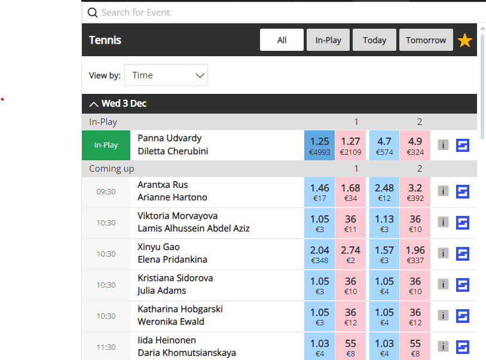
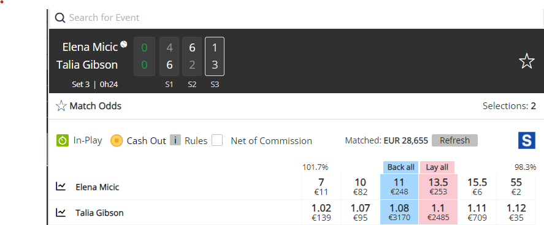
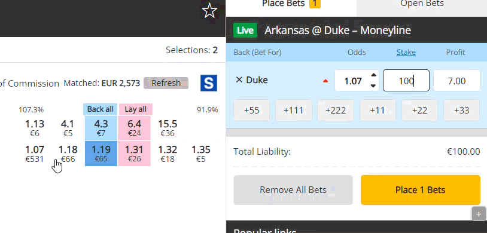
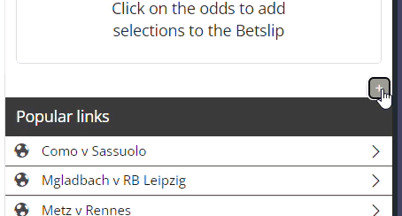

# SharpXch SofaScore Linker

SharpXch sitesinde iyileştirmeler yapan,  maç istatistiklerine hızlı erişim sağlayarak vakit kazandırmayı amaçlayan bir chrome eklentisidir.

## Özellikler

- Her maç için otomatik SofaScore linki

- Bahis miktarlarınızı koruma (oran değiştiğinde kaybolmaz)

- Ayarları gizleme/gösterme butonu

## Kurulum

1. Projeyi indirin veya klonlayın
2. Chrome'da `chrome://extensions/` adresine gidin
3. Sağ üstten "Geliştirici modu"nu açın
4. "Paketlenmemiş öğe yükle" butonuna tıklayın
5. İndirdiğiniz klasörü seçin

## Kullanım

**SofaScore Linkleri:**
- Herhangi bir maç sayfasını açın
- SofaScore logosu otomatik görünecektir
- Logoya tıklayarak maç detaylarına gidin

**Bahis Miktarı Koruma:**
- Eklenti simgesine tıklayın
- "Bahis Miktarlarını Koru" seçeneğini açın
- Girdiğiniz miktarlar artık korunacaktır

**Ayarları Gizleme:**
- Ayarlar bölümünde sağ üstteki +/- butonunu kullanın
- Tercihleriniz otomatik kaydedilir

## Gizlilik

- Hiçbir veri toplanmaz
- Her şey cihazınızda saklanır
- Üçüncü parti sunuculara bağlantı yoktur

## Lisans

Bu proje Hmmyes tarafından lisanslanmıştır.

