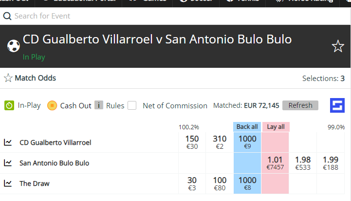
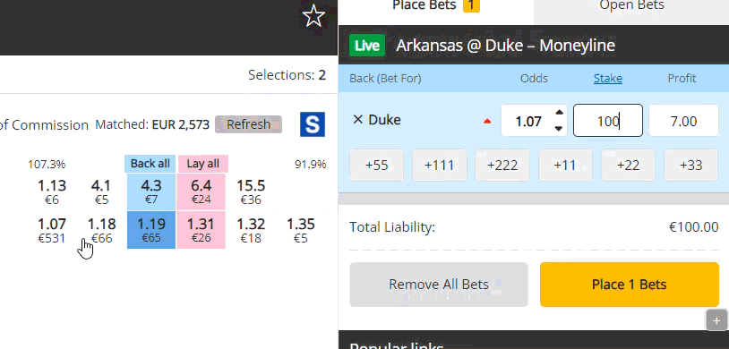
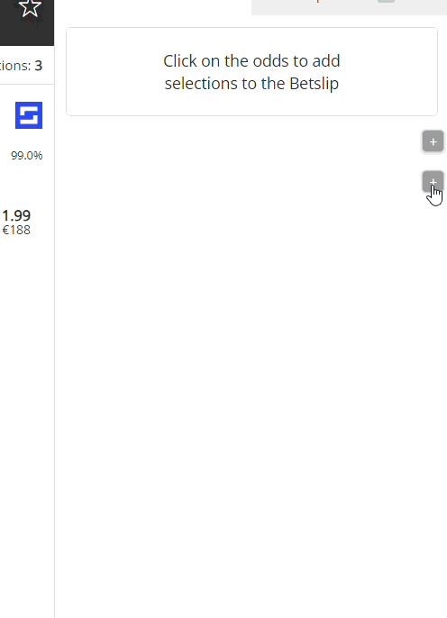

# SharpXch SofaScore Linker

Sofascore linklerini SharpXch sitesine ekler.
SharpXch sitesindeki birçok tasarım hatasını düzeltir.

## Özellikler

- Her maç için otomatik SofaScore linki

- Bahis miktarlarınızı koruma (oran değiştiğinde kaybolmaz)
Bahis oranı her değiştiğine stake miktarını tekrar girme problemini düzeltir.

- Ayarlar ve Populer Links gizleme/gösterme butonu

- Klavye kısayolu ile bahis iptal etme (X tuşu)

## Kurulum

1. Projeyi indirin veya klonlayın.
2. Chrome'da `chrome://extensions/` adresine gidin.
3. Sağ üstten "Geliştirici modu"nu açın.
4. "Paketlenmemiş öğe yükle" butonuna tıklayın.
5. İndirdiğiniz klasörü seçin.

## Kullanım

**SofaScore Linkleri:**
- Canlı maç listelerinde ve maç sayfasının içinde "SofaScore" logosu görünecektir.
- Logoya tıklayarak maç detaylarına gidin.

**Bahis Miktarı Koruma:**
- Eklenti simgesine tıklayın.
- "Bahis Miktarlarını Koru" seçeneğini açın.
- Girdiğiniz miktar artık oran değiştirseniz bile korunacaktır.

**Ayarlar ve Populer Links Kısmını Gizleme:**
- Ayarlar ve Populer Links bölümünde sağ üstteki +/- butonununa tıklayarak menüyü gizleyin.
- Tercihleriniz otomatik kaydedilir.

**Yanlışlıkla Checkbox Tıklamayı Önleme:**
- "Confirm bets before placement / removal" yazısına tıklamak artık checkbox'ı aktif etmez
- Sadece kutucuğun kendisine tıklayarak checkbox'ı açıp kapatabilirsiniz
- Yanlışlıkla aktif etme sorununun önüne geçer

**Bahis İptal Etme:**
- Klavyede **X** tuşuna basarak "Cancel Bet" butonuna anında tıklayabilirsiniz
- İnput alanlarında yazarken çalışmaz (yanlışlıkla iptal etmemek için)

## Gizlilik

- Hiçbir veri toplanmaz
- Her şey cihazınızda saklanır
- Üçüncü parti sunuculara bağlantı yoktur

## Lisans

Bu proje Hmmyes tarafından yapılmıştır.

